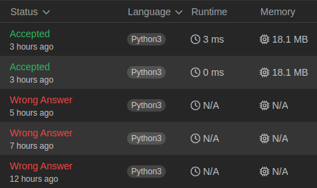

## 4. Median of Two Sorted Arrays

[Link para a questão](https://leetcode.com/problems/median-of-two-sorted-arrays/description/)

### Gravação

[Link para a gravação](https://www.youtube.com/watch?v=8FNuCRVfOgk)

#### Dificuldade: Difícil

### Enunciado
Given two sorted arrays nums1 and nums2 of size m and n respectively, return the median of the two sorted arrays.

The overall run time complexity should be O(log (m+n)).

#### Exemplo
Example 1:

Input: nums1 = [1,3], nums2 = [2] 
Output: 2.00000 
Explanation: merged array = [1,2,3] and median is 2.

Example 2:

Input: nums1 = [1,2], nums2 = [3,4] 
Output: 2.50000 
Explanation: merged array = [1,2,3,4] and median is (2 + 3) / 2 = 2.5.

### Submissões: 

